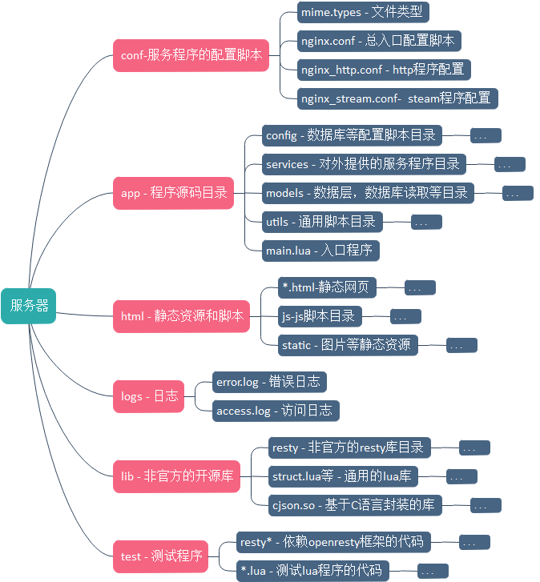

## describe
+ 使用openresty的demo,包括tcpserver、httpserver和websocket server
```
curl localhost:8000/a

<html>
<head><title>403 Forbidden</title></head>
<body bgcolor="white">
<center><h1>403 Forbidden</h1></center>
<hr><center>openresty/1.13.6.1</center>
</body>
</html>

```
```
curl localhost:8000/?"hello"="world"
hello :{"hello":"world"}

curl localhost:8000/mongo?"hello"="world"
mongo :{"hello":"world"}
```
+ http://127.0.0.1:8000/ws.html 进入websocket聊天界面

+ 在demo根目录下，lua client.lua 进入tcp聊天模式

## dependence

- [openresty](http://openresty.org/cn/)  
- [openresty源码](https://github.com/openresty/)
- [lua-resty-mysql](https://github.com/openresty/lua-resty-mysql)
- [lua-resty-redis](https://github.com/openresty/lua-resty-redis)

## 源码介绍



